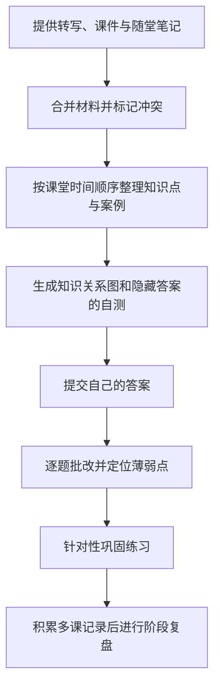

<p align="center">
  
</p>

# Learn Flow · 个人学习笔记与复盘助手

**提供课堂转写、课件或学习目标 → 整理能看懂的笔记与隐藏答案的自测 → 根据作答和学习记录继续练习。**

一个面向零基础 AI 学习者的 Codex Agent Skill。它把课程材料整理成按课堂顺序展开的笔记，保留老师的案例，补充容易理解的产品案例，并通过自测、批改和阶段复盘检查理解。

仓库提供技能说明、调用配置与图标。使用时由 Codex 等支持 Skill 的工具读取材料并生成内容，项目本身无需安装 Python 或 Node.js。

## 📊 工作流程



也可以直接解释一个概念或制定学习计划，不必先完成整套流程。

## ✨ 五种工作模式

| 输入内容 | 工作模式 | 主要输出 |
| --- | --- | --- |
| 课堂文本、转写、课件、字幕或讲义 | 单课笔记 | 课程概览、时间轴、知识点、案例、知识关系图和自测 |
| 上一轮自测的答案 | 批改与薄弱点分析 | 逐题讲解、理解缺口和针对性巩固题 |
| 一个不理解的概念 | 费曼笔记 | 大白话解释、应用例子和理解检验问题 |
| 学习目标、当前水平与可用时间 | 学习计划 | 知识树、分阶段任务、里程碑和复盘安排 |
| 多节笔记、自测与学习记录 | 阶段复盘 | 已掌握内容、反复卡点和下一阶段计划 |

模式选择和输出规则见 [SKILL.md](./SKILL.md)。

## 📖 笔记怎么组织

| 设计 | 对学习者的作用 |
| --- | --- |
| 保留课堂时间顺序 | 按上午、下午或材料原有顺序展开，方便对照录音重听 |
| 案例紧跟知识点 | 每个老师案例后接一个零基础补充产品案例，避免例子与概念脱节 |
| 识别个人标记 | 把“重听”“没听懂”等标记整理为需要进一步理解的内容 |
| 先自测再看答案 | 首轮隐藏答案，收到作答后再批改 |
| 标明材料疑点 | 保留转写疑点、材料冲突和未知内容，不替老师编造结论 |
| 支持局部修改 | 可以只重做某个知识点、补充应用题或调整知识关系图 |

默认单课笔记按材料量安排 3 至 7 个核心知识点和 6 至 10 道题；材料不足时减少题量。

### 一份单课笔记包含什么

| 顺序 | 内容 |
| --- | --- |
| 1 | 课程概览，说明本课问题与核心结论 |
| 2 | 课堂时间顺序，方便定位上午、下午或材料中的位置 |
| 3 | 笔记正文，按知识点串联老师案例与零基础补充案例 |
| 4 | 知识关系图，帮助回看概念之间的联系 |
| 5 | 课后自测，先隐藏答案，等待自己作答 |
| 6 | 一句话复习，提示本课最需要记住的内容 |
| 7 | 需要重听或加深理解的内容 |
| 8 | 待确认内容，注明冲突与疑点 |
| 9 | 根据本次实际学习行为给出的简短鼓励 |

没有对应材料时，不会为了填满栏目虚构案例或疑点。整理顺序和细节要求以技能规则为准。

## 🧱 项目组成

| 部分 | 作用 |
| --- | --- |
| `SKILL.md` | 用 Markdown 定义学习流程、输出格式和质量要求 |
| `agents/openai.yaml` | 配置显示名称、图标、默认提示词与自动调用 |
| `assets/icon.svg` | 提供技能图标 |
| 宿主工具与模型 | 读取你提供的材料，生成笔记并处理后续作答 |

技能本身没有独立模型接口或计费系统，实际使用额度和文件支持范围由宿主工具决定。

## 🚀 快速开始

### 1. 安装到 Codex

在支持内置安装技能的 Codex 对话框中输入下面这段话。

```text
使用 $skill-installer 安装 https://github.com/RoourChen/learn-flow-skill 。技能文件位于仓库根目录。
```

安装完成后，在后续对话中调用技能。如果没有识别到，先确认安装成功，再新建对话或重启 Codex。手动安装时，保留 `SKILL.md`、`agents/` 和 `assets/` 的目录关系，把整个技能目录放入当前工具识别的位置。可参考 [官方技能说明](https://developers.openai.com/codex/skills)。

### 2. 提供课程材料

上传工具能够读取的课件或文本，或直接粘贴课堂内容。只有原始录音时，需要先取得转写文本；本仓库没有提供音频转写引擎。

然后输入以下示例指令。

```text
使用 $learn-flow-skill 整理我上传的课堂转写与课件。
请按上午、下午的顺序整理，保留老师的案例。
我标记“重听”的地方请讲得更简单，最后出题，先不要显示答案。
```

### 3. 作答并继续练习

在同一对话中提交自测答案，请求逐题批改。也可以只调整一个部分。

```text
请只重讲第三个知识点，换一个零基础产品例子，再给我一道应用题。
```

开始新对话做阶段复盘时，需要再次提供相关笔记与作答记录。

## 💬 更多调用示例

以下均为使用示例，不代表已经完成的学习成果。

**解释概念**

```text
使用 $learn-flow-skill，用费曼笔记的方式解释 RAG。
我刚开始学 AI，请先讲用途，再给一个具体产品例子，最后检查我是否理解。
```

**制定计划**

```text
使用 $learn-flow-skill 帮我制定两周的 AI 产品入门计划。
我每天有 1 小时，目标是能解释一个知识库问答产品的基本流程。
请安排实际练习和复盘，不要把时间全部排满。
```

**阶段复盘**

```text
使用 $learn-flow-skill 复盘我这周提供的笔记和自测记录。
请区分“见过但讲不清”和“能够应用”，优先安排反复出错内容的练习。
```

## ⚙️ 输出格式

默认使用 Markdown，按内容加入重点提示和 Mermaid 知识关系图。若阅读工具不支持这些扩展格式，可以明确要求基础 Markdown。

```text
请输出基础 Markdown 笔记，只用标题、段落、列表、链接和简单表格。
把知识关系图改成缩进列表，不要提示块、粗体或 Mermaid 源码。
```

Word、PDF 等文件转换能力取决于宿主工具，本仓库不包含对应导出程序。

## ❓ 常见问题

**只有录音，可以直接整理吗？**

需要先让宿主工具或其他转写工具得到文本，再提供给技能。本仓库只定义如何整理材料，没有音频识别程序。

**课件和老师口头说法不一致怎么办？**

规则优先参考课件中的正式定义，同时保留口头补充。相互冲突的内容应列入“待确认内容”，由你回看原材料核对。

**为什么制定计划时没有排满每天的时间？**

技能要求每日安排最多使用你承诺时间的 80%，其余留给补课和临时中断。学习计划还会安排实际练习、检查点与复盘。

**换一个对话还能继续复盘吗？**

可以继续，但需要提供相关笔记和作答记录。技能不会自动读取其他对话或不存在于当前上下文中的学习历史。

## 📁 目录结构

```text
learn-flow-skill/
├── README.md          # 项目介绍与使用指南
├── SKILL.md           # 五种学习模式与质量检查规则
├── LICENSE            # MIT 许可证及原有署名
├── agents/
│   └── openai.yaml    # 显示名称、默认提示词与调用配置
└── assets/
    └── icon.svg       # 技能图标
```

## 🧪 使用检查

仓库当前没有自动化测试脚本。可以用一小段包含时间顺序、课堂案例和“重听”标记的材料检查输出。

- 笔记是否保留原始顺序，老师案例是否紧跟对应知识点。
- 首轮自测是否隐藏答案，提交作答后是否按题目批改。
- 材料有冲突时是否标明疑点，是否避免补造老师没有说过的内容。

## 📌 当前边界

技能负责指导模型处理已提供的材料，文件读取、图片识别和 Mermaid 渲染取决于宿主工具。仓库没有独立网页、课程数据库或自动跨会话记忆服务。

输出质量取决于材料与模型。整理出笔记只是完成了学习资料准备，能否掌握仍需要自己作答、解释和应用。

## 📄 许可与项目文件

采用 [MIT License](./LICENSE)，许可证保留原有版权署名。完整行为规则见 [SKILL.md](./SKILL.md)，显示名称与默认调用语句见 [agents/openai.yaml](./agents/openai.yaml)。
